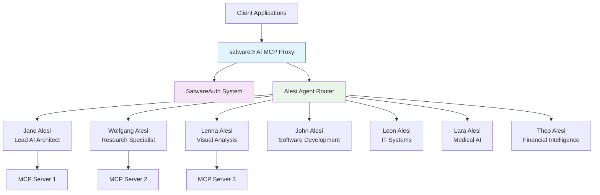

# 🚀 **satware® AI MCP Proxy**

**Enterprise-grade Model Context Protocol server for the Alesi AGI ecosystem**

[](https://github.com/jane-alesi/satai-mcp-proxy)
[](LICENSE)
[](https://chat.satware.ai)
[](https://satware.ai)

## 🌟 **Overview**

The **satware® AI MCP Proxy** is a powerful, enterprise-grade Model Context Protocol server designed specifically for the Alesi AGI ecosystem. It provides intelligent routing, authentication, and management of MCP clients with seamless integration to [chat.satware.ai](https://chat.satware.ai).

### **Key Features**

🔹 **Intelligent Agent Routing** - Automatically routes requests to the most suitable Alesi AGI agent  
🔹 **Enterprise Security** - JWT authentication, rate limiting, and comprehensive security headers  
🔹 **Alesi AGI Integration** - Native support for the complete Alesi AGI family  
🔹 **Advanced Monitoring** - Real-time metrics, logging, and health monitoring  
🔹 **Multi-Transport Support** - Streamable HTTP with SSE fallback  
🔹 **Docker Ready** - Complete containerization with production-ready configuration  

## 🏗️ **Architecture**



## 🚀 **Quick Start**

### **Installation**

```bash
# Clone the repository
git clone https://github.com/jane-alesi/satai-mcp-proxy.git
cd satai-mcp-proxy

# Install dependencies
pnpm install

# Start the server
pnpm start
```

### **Docker Deployment**

```bash
# Build the image
pnpm run docker:build

# Run the container
pnpm run docker:run
```

### **Environment Configuration**

```bash
# Required Environment Variables
SATWARE_JWT_SECRET=your-jwt-secret-key
SATWARE_API_KEY=your-api-key
CHAT_SATWARE_URL=https://chat.satware.ai
ALESI_API_KEY=your-alesi-api-key

# Optional Configuration
PORT=50880
LOG_LEVEL=info
NODE_ENV=production
```

## 🔐 **Authentication**

The proxy supports multiple authentication methods:

### **JWT Tokens (Recommended)**
```bash
curl -H "Authorization: Bearer <jwt-token>" \
     https://your-proxy.satware.ai/ping
```

### **API Keys**
```bash
curl -H "Authorization: ApiKey <api-key>" \
     https://your-proxy.satware.ai/ping
```

### **Legacy Bearer Tokens**
```bash
curl -H "Authorization: Bearer <legacy-token>" \
     https://your-proxy.satware.ai/ping
```

## 🤖 **Alesi AGI Family**

The proxy intelligently routes requests to specialized Alesi agents:

| Agent | Specialization | Capabilities |
|-------|---------------|--------------|
| **Jane Alesi** | Lead AI Architect | Multi-phase reasoning, verification-first, tool orchestration |
| **Wolfgang Alesi** | Research Specialist | Research analysis, data interpretation, academic writing |
| **Lenna Alesi** | Visual Analysis | Image processing, visual analysis, design consultation |
| **John Alesi** | Software Development | Code generation, architecture design, optimization |
| **Leon Alesi** | IT Systems | System integration, infrastructure planning, troubleshooting |
| **Lara Alesi** | Medical AI | Medical analysis, healthcare systems, clinical support |
| **Theo Alesi** | Financial Intelligence | Financial analysis, investment strategy, market intelligence |

## 📡 **API Endpoints**

### **Health & Status**
```bash
GET /ping              # Health check with detailed metrics
GET /agents            # Available Alesi agents information
GET /metrics           # Comprehensive system metrics
```

### **Client Management**
```bash
POST /start            # Start MCP clients with Alesi integration
GET /clients           # List active clients with agent information
DELETE /clients/:id    # Stop specific client
```

### **MCP Operations**
```bash
POST /mcp/:clientId    # Send MCP requests with intelligent routing
```

### **Development**
```bash
POST /auth/token       # Generate test tokens (development only)
```

## 🔧 **Configuration**

### **Starting MCP Clients**

```javascript
// Example client configuration
const mcpServers = {
  "filesystem": {
    "command": "npx",
    "args": ["-y", "@modelcontextprotocol/server-filesystem", "/path/to/files"],
    "env": {
      "NODE_ENV": "production"
    }
  },
  "web-search": {
    "url": "https://api.example.com/mcp"
  }
};

// Start clients with Alesi integration
fetch('/start', {
  method: 'POST',
  headers: {
    'Content-Type': 'application/json',
    'Authorization': 'Bearer <your-token>'
  },
  body: JSON.stringify({ mcpServers })
});
```

### **Agent Routing**

The proxy automatically routes requests based on:
- **Query Analysis** - Keyword and capability matching
- **User Preferences** - Specified agent preferences
- **Specialization** - Agent expertise areas
- **Load Balancing** - Agent availability and performance

## 📊 **Monitoring & Metrics**

### **Health Check Response**
```json
{
  "status": "ok",
  "service": "satware® AI MCP Proxy",
  "version": "2.0.0",
  "ecosystem": "alesi-agi",
  "platform": "chat.satware.ai",
  "uptime": 3600,
  "metrics": {
    "activeClients": 5,
    "totalRequests": 1250,
    "totalErrors": 2
  },
  "agents": ["jane-alesi", "wolfgang-alesi", "lenna-alesi"],
  "timestamp": "2025-06-14T11:00:00.000Z"
}
```

### **Metrics Dashboard**
- **Request Metrics** - Total requests, errors, response times
- **Client Metrics** - Active clients, request distribution
- **Agent Metrics** - Agent usage, routing efficiency
- **System Metrics** - Memory usage, uptime, performance

## 🔒 **Security Features**

### **Enterprise Security**
- **Helmet.js** - Security headers and CSP
- **Rate Limiting** - 1000 requests per 15 minutes per IP
- **CORS Protection** - Configured for satware® AI domains
- **Input Validation** - Comprehensive request validation
- **Audit Logging** - Complete request/response logging

### **Authentication & Authorization**
- **JWT Validation** - satware® AI specific claims validation
- **Role-Based Access** - Standard, Premium, Enterprise, Developer levels
- **Permission System** - Read, Execute, Create, Admin operations
- **Session Management** - Secure session handling

## 🐳 **Docker Support**

### **Dockerfile Features**
- **Node.js 23** - Latest stable runtime
- **Python Support** - uvx for Python MCP servers
- **Security** - Non-root user, minimal attack surface
- **Optimization** - Multi-stage build, layer caching

### **Production Deployment**
```yaml
# docker-compose.yml
version: '3.8'
services:
  satai-mcp-proxy:
    image: satware/satai-mcp-proxy:2.0.0
    ports:
      - "50880:50880"
    environment:
      - SATWARE_JWT_SECRET=${JWT_SECRET}
      - SATWARE_API_KEY=${API_KEY}
      - NODE_ENV=production
    volumes:
      - ./logs:/app/logs
    restart: unless-stopped
```

## 🛠️ **Development**

### **Project Structure**
```
satai-mcp-proxy/
├── lib/
│   ├── server.js              # Main server with Alesi integration
│   ├── satware-auth.js        # Authentication system
│   ├── alesi-integration.js   # Alesi AGI routing system
│   └── port-finder.js         # Port management
├── bin/
│   └── index.js               # Entry point
├── docs/
│   └── GIT_STRATEGY.md        # Development workflow
├── .github/
│   ├── workflows/ci.yml       # CI/CD pipeline
│   └── PULL_REQUEST_TEMPLATE.md
├── Dockerfile                 # Container configuration
├── package.json               # Dependencies and scripts
└── README.md                  # This file
```

### **Development Scripts**
```bash
pnpm dev                # Development with hot reload
pnpm test               # Run test suite
pnpm test:coverage      # Test with coverage
pnpm lint               # Code linting
pnpm format             # Code formatting
```

### **Git Workflow**
We use **Enterprise GitFlow+** with:
- **Main Branch** - Production-ready code
- **Develop Branch** - Integration hub
- **Feature Branches** - `feature/SAT-###-description`
- **Release Branches** - `release/x.x.x`

See [GIT_STRATEGY.md](docs/GIT_STRATEGY.md) for complete workflow documentation.

## 🔗 **Integration**

### **chat.satware.ai Integration**
The proxy is designed for seamless integration with the satware® AI platform:

```javascript
// Platform integration example
const satwareClient = new SatwareAIClient({
  proxyUrl: 'https://your-proxy.satware.ai',
  apiKey: 'your-api-key',
  preferredAgent: 'jane-alesi'
});

await satwareClient.start({
  mcpServers: yourMcpConfig
});
```

### **Custom Agent Routing**
```javascript
// Custom routing logic
const routingConfig = {
  userPreference: 'wolfgang-alesi',
  fallbackAgent: 'jane-alesi',
  capabilities: ['research-analysis', 'data-interpretation']
};
```

## 📈 **Performance**

### **Benchmarks**
- **Startup Time** - < 2 seconds
- **Request Latency** - < 50ms (excluding MCP server time)
- **Throughput** - 1000+ requests/minute
- **Memory Usage** - < 100MB base
- **Concurrent Clients** - 100+ simultaneous connections

### **Optimization Features**
- **Connection Pooling** - Efficient client management
- **Request Caching** - Intelligent response caching
- **Load Balancing** - Agent load distribution
- **Graceful Shutdown** - Zero-downtime deployments

## 🤝 **Contributing**

We welcome contributions to the satware® AI MCP Proxy! Please see [CONTRIBUTING.md](CONTRIBUTING.md) for guidelines.

### **Development Setup**
1. Fork the repository
2. Create a feature branch: `feature/SAT-###-your-feature`
3. Make your changes
4. Add tests and documentation
5. Submit a pull request

### **Code Standards**
- **ESLint** - Code linting and formatting
- **Conventional Commits** - Standardized commit messages
- **JSDoc** - Comprehensive code documentation
- **Testing** - Unit and integration tests required

## 📄 **License**

This project is licensed under the MIT License - see the [LICENSE](LICENSE) file for details.

## 🆘 **Support**

### **Getting Help**
- **Documentation** - [docs/](docs/)
- **Issues** - [GitHub Issues](https://github.com/jane-alesi/satai-mcp-proxy/issues)
- **Discussions** - [GitHub Discussions](https://github.com/jane-alesi/satai-mcp-proxy/discussions)
- **Email** - ai@satware.ai

### **Enterprise Support**
For enterprise support and custom integrations, contact [satware® AI](https://satware.ai).

## 🔮 **Roadmap**

### **Version 2.1.0**
- [ ] TypeScript migration
- [ ] Enhanced monitoring dashboard
- [ ] Advanced caching strategies
- [ ] WebSocket support

### **Version 2.2.0**
- [ ] Multi-region deployment
- [ ] Advanced load balancing
- [ ] Custom agent plugins
- [ ] GraphQL API

### **Version 3.0.0**
- [ ] Distributed architecture
- [ ] Machine learning routing
- [ ] Advanced analytics
- [ ] Enterprise SSO integration

---

**Built with ❤️ by the satware® AI Team**

🌐 **Website**: [satware.ai](https://satware.ai)  
💬 **Platform**: [chat.satware.ai](https://chat.satware.ai)  
📧 **Contact**: ai@satware.ai  
🐙 **GitHub**: [@jane-alesi](https://github.com/jane-alesi)  

*Empowering the future of AI through the Alesi AGI ecosystem*