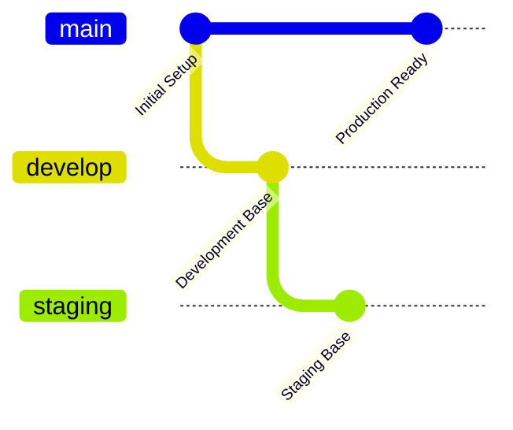

# 🌿 **Git Strategy for satai-mcp-proxy**

## 📋 **Overview**

This document outlines the comprehensive Git strategy for the satware® AI MCP Proxy project, designed to support enterprise-grade development, deployment, and maintenance.

## 🎯 **Strategy Goals**

- **🔒 Production Stability**: Ensure main branch is always deployable
- **🚀 Feature Isolation**: Develop features independently without conflicts  
- **⚡ Rapid Deployment**: Enable quick hotfixes and releases
- **👥 Team Collaboration**: Support multiple developers efficiently
- **📊 Traceability**: Maintain clear history and accountability

## 🌳 **Branching Model: Enterprise GitFlow+**

### **Core Branches**



| Branch | Purpose | Protection | Merge Strategy | Auto-Deploy |
|--------|---------|------------|----------------|-------------|
| `main` | Production code | 🔒 **Strict** | Squash only | ✅ Production |
| `develop` | Integration hub | 🔒 **Protected** | Merge commits | ✅ Development |
| `staging` | Pre-production | 🔒 **Protected** | Fast-forward | ✅ Staging |

### **Supporting Branches**

| Pattern | Purpose | Base | Target | Lifetime |
|---------|---------|------|--------|----------|
| `feature/SAT-###-description` | New features | `develop` | `develop` | Days-Weeks |
| `bugfix/SAT-###-description` | Bug fixes | `develop` | `develop` | Hours-Days |
| `hotfix/###-description` | Critical fixes | `main` | `main` + `develop` | Hours |
| `release/x.x.x` | Release prep | `develop` | `main` | Days |
| `experiment/description` | R&D work | `develop` | Optional | Variable |

## 🔄 **Workflow Processes**

### **1. Feature Development**

```bash
# 1. Start from develop
git checkout develop
git pull origin develop

# 2. Create feature branch
git checkout -b feature/SAT-123-add-alesi-integration

# 3. Develop and commit
git add .
git commit -m "feat(auth): add Alesi AGI authentication"

# 4. Push and create PR
git push origin feature/SAT-123-add-alesi-integration
# Create PR: feature/SAT-123-add-alesi-integration → develop
```

### **2. Release Process**

```bash
# 1. Create release branch
git checkout develop
git pull origin develop
git checkout -b release/2.0.0

# 2. Prepare release
npm version 2.0.0
# Update CHANGELOG.md
# Final testing

# 3. Merge to main
git checkout main
git merge --no-ff release/2.0.0
git tag -a v2.0.0 -m "Release version 2.0.0"

# 4. Merge back to develop
git checkout develop
git merge --no-ff release/2.0.0

# 5. Clean up
git branch -d release/2.0.0
```

### **3. Hotfix Process**

```bash
# 1. Create hotfix from main
git checkout main
git pull origin main
git checkout -b hotfix/2.0.1-security-patch

# 2. Fix and test
git commit -m "fix(security): patch authentication vulnerability"

# 3. Merge to main
git checkout main
git merge --no-ff hotfix/2.0.1-security-patch
git tag -a v2.0.1 -m "Hotfix version 2.0.1"

# 4. Merge to develop
git checkout develop
git merge --no-ff hotfix/2.0.1-security-patch

# 5. Clean up
git branch -d hotfix/2.0.1-security-patch
```

## 🔒 **Branch Protection Rules**

### **Main Branch**
- ✅ Require pull request reviews (2 reviewers)
- ✅ Require status checks to pass
- ✅ Require branches to be up to date
- ✅ Require conversation resolution
- ✅ Restrict pushes to admins only
- ✅ Require signed commits

### **Develop Branch**
- ✅ Require pull request reviews (1 reviewer)
- ✅ Require status checks to pass
- ✅ Require conversation resolution
- ✅ Allow force pushes by admins

### **Staging Branch**
- ✅ Require status checks to pass
- ✅ Restrict pushes to develop merges only

## 📝 **Commit Standards**

### **Conventional Commits Format**
```
<type>(<scope>): <description>

[optional body]

[optional footer(s)]
```

### **Types**
- `feat`: New feature
- `fix`: Bug fix
- `docs`: Documentation changes
- `style`: Code style changes
- `refactor`: Code refactoring
- `test`: Test additions/changes
- `chore`: Build/tooling changes
- `security`: Security improvements

### **Examples**
```bash
feat(auth): add satware® AI token validation
fix(server): resolve client connection timeout
docs(readme): update installation instructions
security(deps): update vulnerable dependencies
```

## 🏷️ **Versioning Strategy**

### **Semantic Versioning (SemVer)**
- **MAJOR.MINOR.PATCH** (e.g., 2.1.3)
- **MAJOR**: Breaking changes
- **MINOR**: New features (backward compatible)
- **PATCH**: Bug fixes

### **Pre-release Versions**
- **Alpha**: `2.0.0-alpha.1` (internal testing)
- **Beta**: `2.0.0-beta.1` (external testing)
- **RC**: `2.0.0-rc.1` (release candidate)

### **satware® AI Specific Versioning**
- **Enterprise releases**: Even minor versions (2.0.x, 2.2.x)
- **Feature releases**: Odd minor versions (2.1.x, 2.3.x)
- **LTS versions**: Every 4th major version (4.x, 8.x, 12.x)

## 🚀 **CI/CD Integration**

### **Automated Workflows**

| Trigger | Actions | Environment |
|---------|---------|-------------|
| PR to `develop` | Test, Lint, Security Scan | - |
| Push to `develop` | Deploy to Development | dev.satware.ai |
| Push to `staging` | Deploy to Staging | staging.satware.ai |
| Push to `main` | Deploy to Production | satware.ai |
| Tag creation | Create GitHub Release | - |

### **Quality Gates**
- ✅ All tests pass (unit, integration, e2e)
- ✅ Code coverage > 80%
- ✅ Security scan passes
- ✅ Performance benchmarks met
- ✅ Documentation updated

## 🔐 **Security Considerations**

### **Access Control**
- **Admin**: Full access (Michael Wegener)
- **Maintainer**: Merge permissions
- **Developer**: PR creation only
- **Read-only**: View access

### **Secret Management**
- ❌ Never commit secrets to repository
- ✅ Use GitHub Secrets for CI/CD
- ✅ Use environment variables
- ✅ Rotate secrets regularly

### **Signed Commits**
- ✅ Required for main branch
- ✅ GPG key verification
- ✅ Commit signature validation

## 📊 **Monitoring & Metrics**

### **Repository Health**
- PR merge time
- Build success rate
- Test coverage trends
- Security vulnerability count
- Code quality metrics

### **Team Productivity**
- Commit frequency
- PR review time
- Feature delivery time
- Bug fix time
- Release frequency

## 🛠️ **Tools & Integrations**

### **Required Tools**
- **Git**: Version control
- **GitHub**: Repository hosting
- **GitHub Actions**: CI/CD
- **pnpm**: Package management
- **Docker**: Containerization

### **Recommended Tools**
- **Conventional Commits**: Commit formatting
- **Husky**: Git hooks
- **lint-staged**: Pre-commit linting
- **Semantic Release**: Automated versioning

## 📚 **Best Practices**

### **Do's**
- ✅ Write descriptive commit messages
- ✅ Keep branches focused and small
- ✅ Test thoroughly before merging
- ✅ Update documentation with changes
- ✅ Review code carefully
- ✅ Use meaningful branch names

### **Don'ts**
- ❌ Commit directly to main/develop
- ❌ Force push to protected branches
- ❌ Merge without review
- ❌ Include unrelated changes in PRs
- ❌ Commit secrets or credentials
- ❌ Skip testing

## 🆘 **Emergency Procedures**

### **Critical Production Issue**
1. Create hotfix branch from main
2. Implement minimal fix
3. Test thoroughly
4. Fast-track review process
5. Deploy immediately
6. Post-mortem analysis

### **Rollback Procedure**
1. Identify last known good commit
2. Create rollback branch
3. Revert problematic changes
4. Deploy rollback
5. Investigate root cause

## 📞 **Support & Contact**

- **Git Strategy Questions**: @satwareAG-ironMike
- **Technical Issues**: GitHub Issues
- **Security Concerns**: security@satware.ai
- **Process Improvements**: Team discussion

---

**Last Updated**: 2025-06-14  
**Version**: 1.0  
**Owner**: satware® AI Development Team